

# kuaishou_one_spider

  

> 🔥 Kuaishou data collection tool / Kuaishou crawler GUI, supporting keyword video collection, comment collection, video detail collection, creator profile video collection, video download, CSV export, and link conversion.
>
> 💡 Supports Windows/macOS with no Python environment required. This repository is used for software introduction, release distribution, usage documentation, and issue feedback. The complete source code is not publicly available.
>
> [⬇️Download Latest Release](https://github.com/mashukui/kuaishou_one_spider/releases/) | [🎬Video Demo](https://www.bilibili.com/video/BV1psRfBkEot/) | [🏠Homepage](https://mashukui.github.io/kuaishou_one_spider/) | [💳Purchase Access](https://mgnb.pro/product/kuaishou)

  <a href="README.md">简体中文 README</a> | <a href="README.en.md">English README</a>

## 👋 Overview

`kuaishou_one_spider` is a desktop GUI tool designed for Kuaishou data collection scenarios. It combines keyword video collection, comment collection, video detail collection, creator profile video collection, and link conversion into one client. Users do not need to install or configure a Python environment. Download the client, log in, and start using it.

It is suitable for the following scenarios:

| Scenario | Description |
| --- | --- |
| ✅ Lead generation | Collect potential leads from comments under industry, brand, or competitor-related videos |
| ✅ Public opinion analysis | Collect keyword-related videos and comments for hot event tracking, propagation analysis, and reputation analysis |
| ✅ Content research | Analyze popular videos, topic tags, interaction data, and viral content directions |
| ✅ Kuaishou operations | Convert profile links, Kuaishou IDs, uids, and video links between different formats, and archive collected data |

## ⚙️ Features

| Feature | Description | Output |
| --- | --- | --- |
| ✅ Keyword video collection | Search Kuaishou videos by keyword and collect basic video data | CSV |
| ✅ Comment collection | Collect comments from keyword search results or specified video links | CSV |
| ✅ Video detail collection | Collect video details from video links and support video download | CSV, video files |
| ✅ Creator profile video collection | Collect video lists from creator profile links and support video download | CSV, video files |
| ✅ Link and uid conversion | Convert between profile links, Kuaishou IDs, uids, and video links | CSV |
| ✅ Incremental saving | Save data to CSV after each page to reduce data loss caused by interruptions | CSV |
| ✅ Runtime logs | Record runtime logs for troubleshooting | logs files |

## 🚀 Quick Start

1. Open [Releases](https://github.com/mashukui/kuaishou_one_spider/releases/) and download the latest version.
2. Extract the package and run the client for your operating system.
3. Use the built-in cookie helper to configure your cookie.
4. Log in to the software account (no account yet? [Day pass from 19 CNY, instant activation](#-pricing)).
5. Select a collection module and enter a keyword, video link, or profile link.
6. Click "Start" and wait for the collection task to finish.
7. Check the CSV files, video files, and log files in the software directory.

## 💻 Supported Platforms

| Platform | Support |
| --- | --- |
| Windows | Supported. Download and run the Windows client |
| macOS | Supported. Download and run the macOS client |

## 🖼️ Screenshots

### Keyword Video and Comment Collection

Keyword video and comment collection interface:

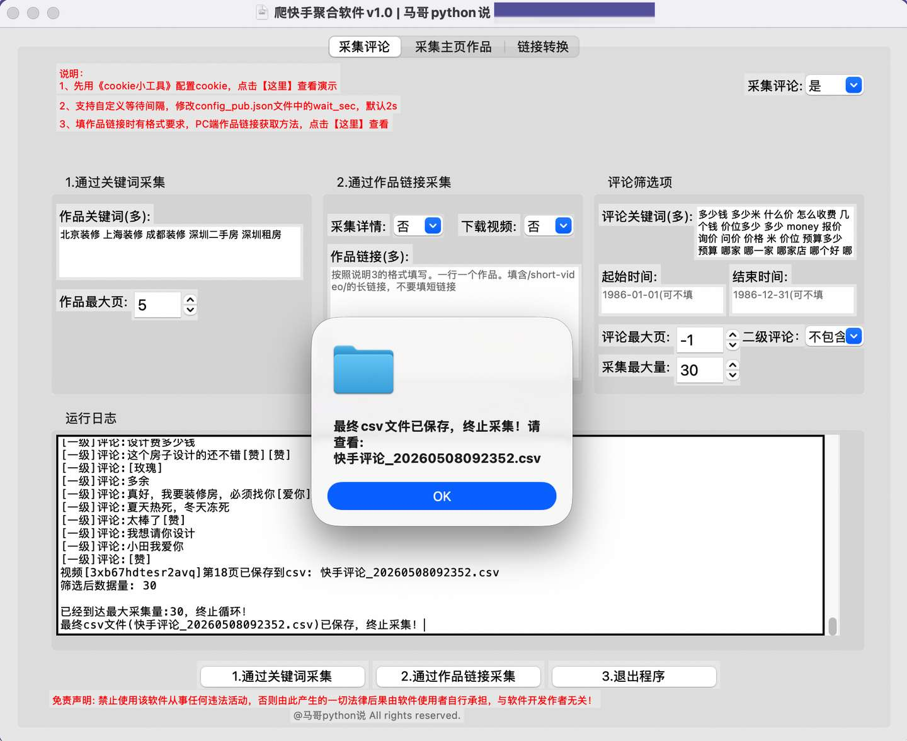

Search video result:

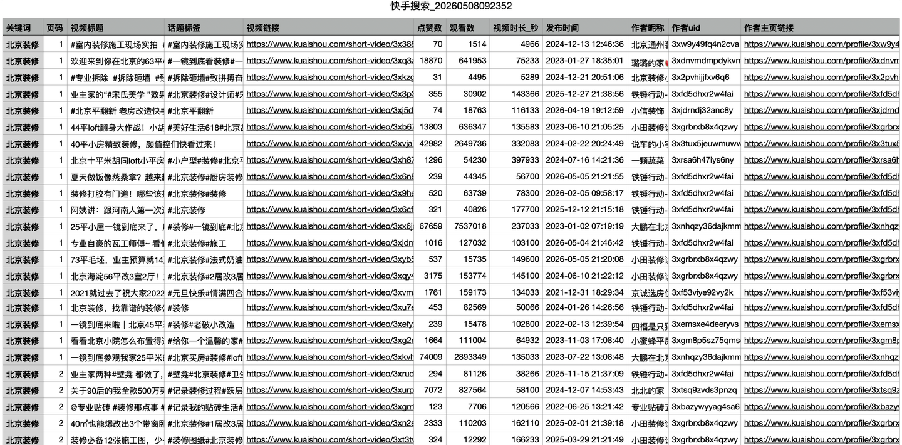

Comment collection result:

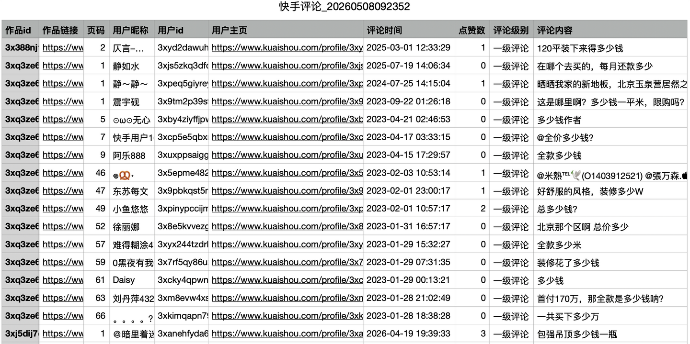

### Video Detail Collection

Video detail collection interface:

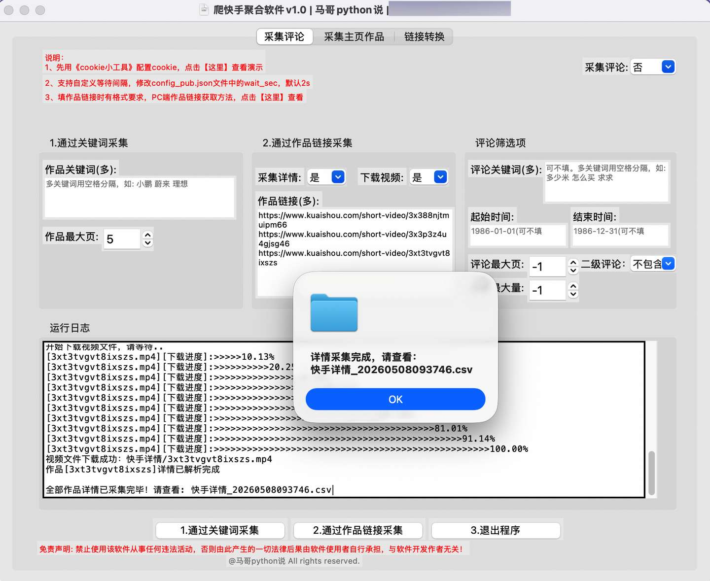

Video detail collection result:

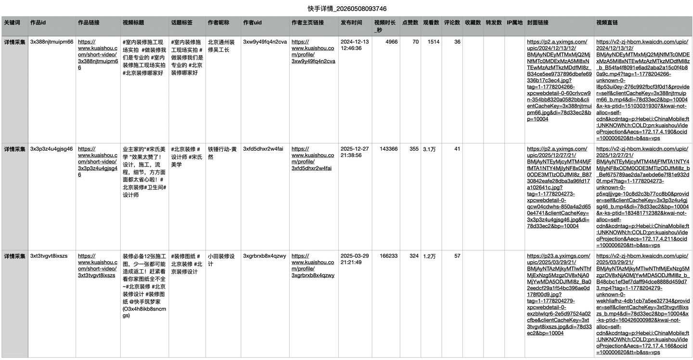

Automatically downloaded video files:

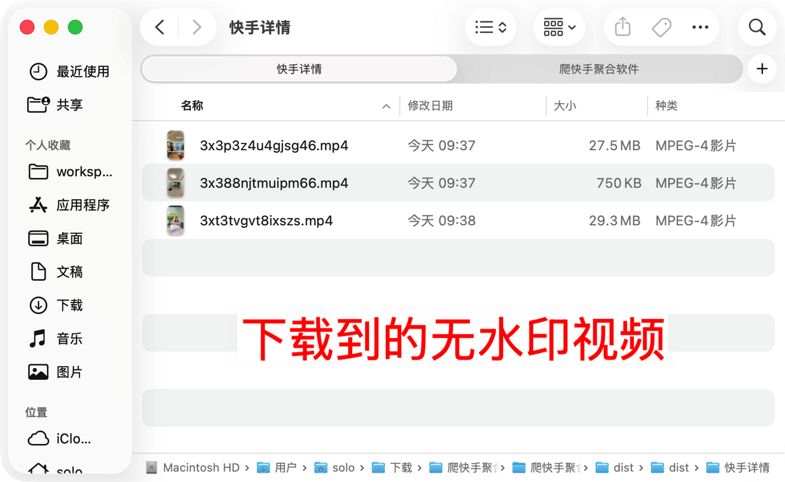

### Creator Profile Video Collection

Creator profile video collection interface:

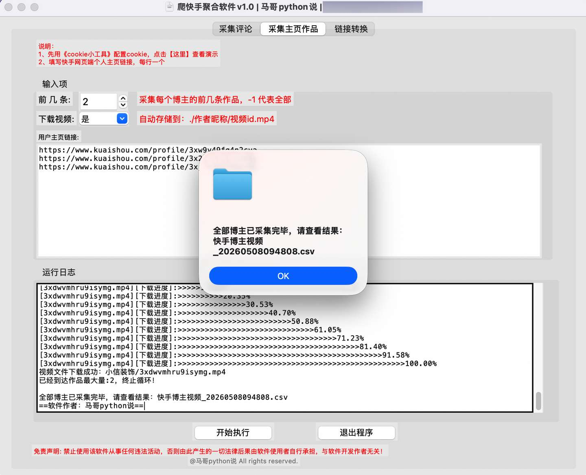

Creator profile video collection result:

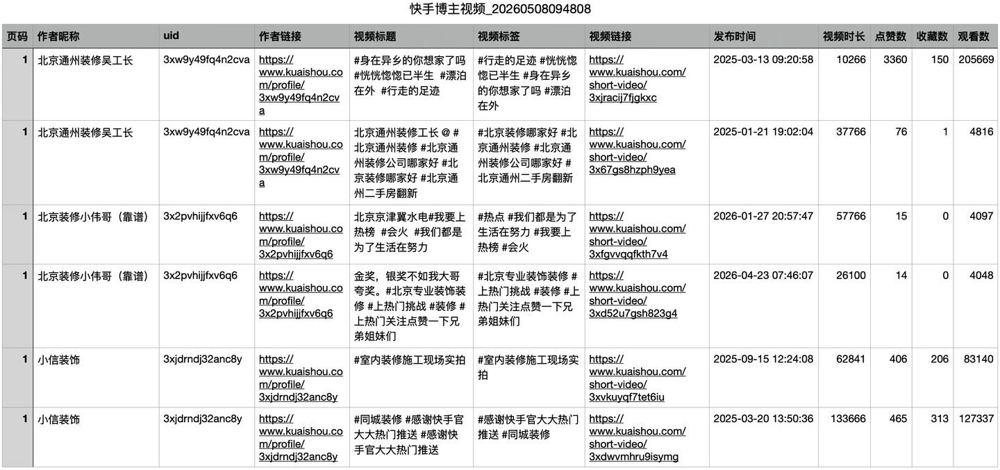

Automatically downloaded creator profile video files:

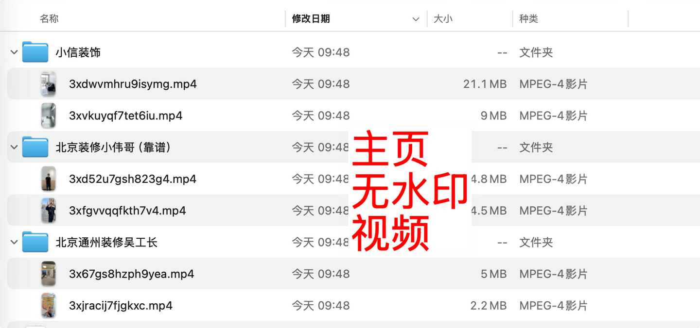

### Link and uid Conversion

Convert a profile link to a Kuaishou ID:

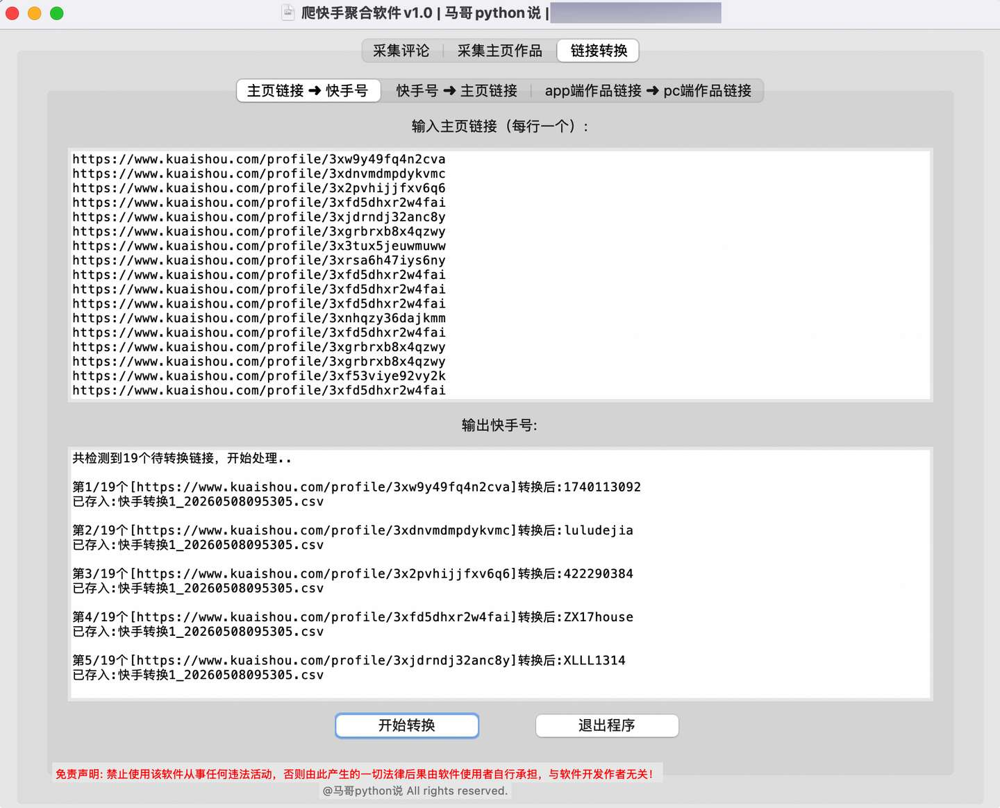

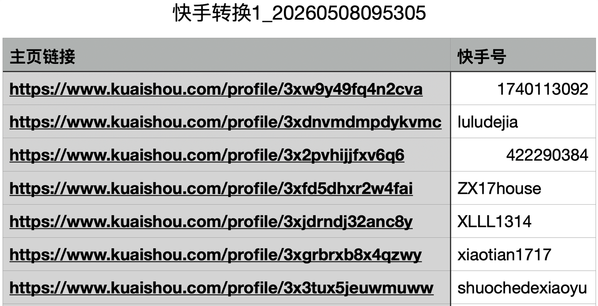

Convert a Kuaishou ID to a profile link:

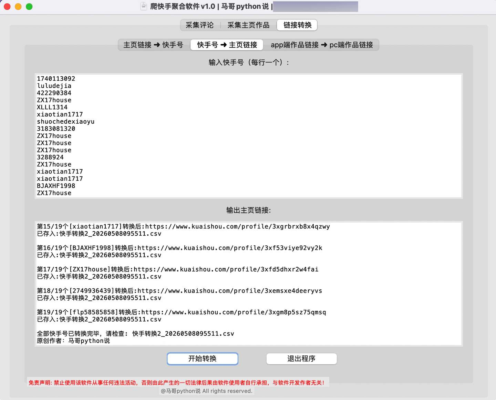

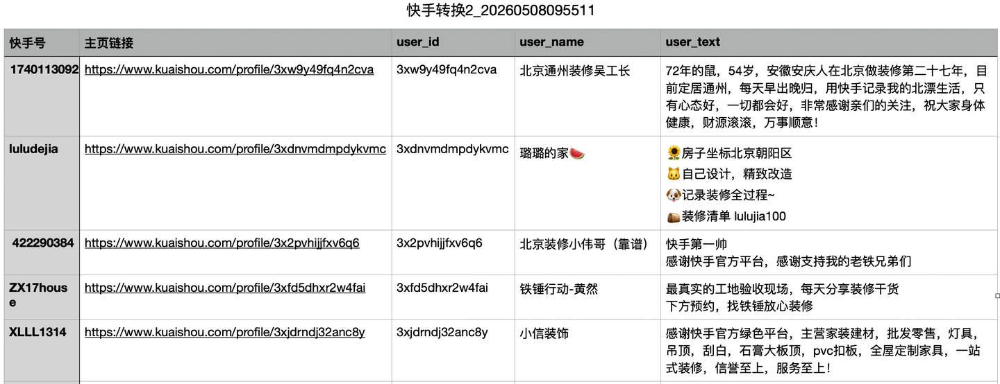

Convert a mobile app video link to a PC video link:

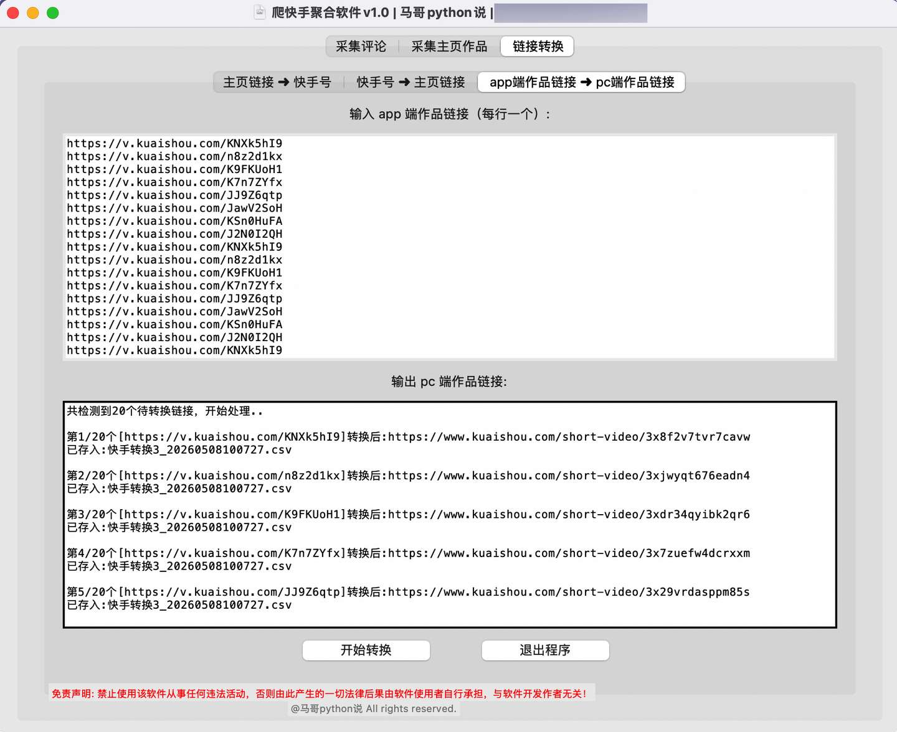

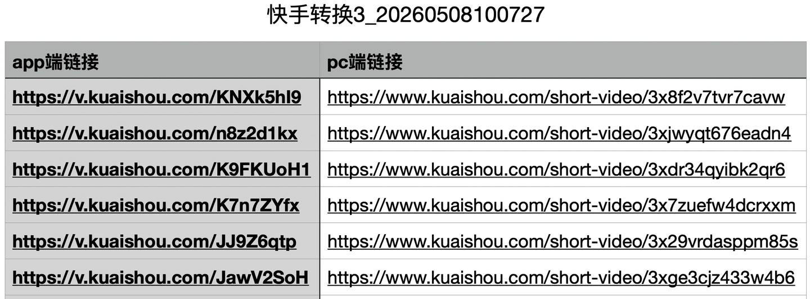

## 📊 Output Fields

The software generates different CSV files based on the selected collection module. Since there are many fields, the main field groups are shown first. You can expand the sections below to view the full field lists.

### Search Video Data

- Collection info: keyword, page
- Video info: video title, topic tags, video link, video duration, published time
- Author info: author nickname, author uid, author profile link
- Interaction data: likes, views

View full search video fields

Keyword, page, video title, topic tags, video link, likes, views, video duration in seconds, published time, author nickname, author uid, author profile link

### Comment Data

- Collection info: video id, video link, page
- Commenter info: user nickname, user id, user profile
- Comment info: comment time, comment likes, comment level, comment content

View full comment fields

Video id, video link, page, user nickname, user id, user profile, comment time, comment likes, comment level, comment content

### Video Detail Data

- Collection info: keyword, video id, video link
- Video info: video title, topic tags, published time, video duration, IP location, cover link, direct video link
- Author info: author nickname, author uid, author profile link
- Interaction data: likes, views, comments, favorites, shares

View full video detail fields

Keyword, video id, video link, video title, topic tags, author nickname, author uid, author profile link, published time, video duration in seconds, likes, views, comments, favorites, shares, IP location, cover link, direct video link

### Creator Profile Video Data

- Collection info: page
- Author info: author nickname, uid, author profile link
- Video info: video title, video tags, video link, published time, video duration
- Interaction data: likes, favorites, views

View full creator profile video fields

Page, author nickname, uid, author link, video title, video tags, video link, published time, video duration, likes, favorites, views

## 🛠️ Technical Notes

The software is developed in Python. Core modules include:

| Module | Purpose |
| --- | --- |
| tkinter | GUI interface |
| playwright | Browser automation (real browser environment) |
| json | Response parsing |
| pandas | CSV export |
| logging | Runtime logging |

The software collects data through a real browser environment driven by Playwright. During collection, results are saved by page by default. The interval between pages is usually about 1-2 seconds, which helps control the collection pace and reduce data loss caused by unexpected interruptions.

## 💰 Pricing

| Plan | Duration | Price | Recommended Usage |
| --- | --- | --- | --- |
| Day pass | 1 day | 19 CNY | Trial use or small one-time tasks |
| Monthly pass | 1 month | 149 CNY | Short-term collection needs |
| Quarterly pass | 3 months | 349 CNY | Medium-term collection needs |
| Yearly pass | 1 year | 799 CNY | Long-term stable use |

Purchase page: [https://mgnb.pro/product/kuaishou](https://mgnb.pro/product/kuaishou)

## 🔐 License and Activation Rules

- The software uses account and password login (a phone number and password are provided after purchase). One account can only be used on one computer.
- Only one software instance is allowed on a single computer. Multiple concurrent instances are not supported.
- The software is maintained by the author, and future versions will be published through GitHub Releases.

## 🕒 Changelog

| Version | Date | Notes |
|---|---|---|
| v2a2 (official v2 release) | 2026-08-24 | Collection switched to Playwright; several fixes for improved stability |
| v1.1 | 2026-05-11 | Fixed ConnectionResetError (v1.0 is the initial release) |

> For the full release history, see [Releases](https://github.com/mashukui/kuaishou_one_spider/releases)

## ❓ FAQ

### Can I use the software after changing computers or reinstalling the system?

Yes. Activation is bound to one computer per account. To switch devices, contact the WeChat official account `老男孩的平凡之路` and request unbinding; after that you can log in on the new computer.

### Do I need to purchase again for software updates?

No. During the license period, all future versions are freely available on [GitHub Releases](https://github.com/mashukui/kuaishou_one_spider/releases). Just download the latest version and reinstall.

### Do I need to install Python?

No. The software is packaged as a desktop client. Download the version for your operating system and run it directly.

### What is the cookie used for?

The cookie allows the software to access platform data under your current account session. Please use your own account cookie and keep related files secure.

### Will collected data be lost if the task is interrupted?

The software saves CSV files by page instead of waiting until the whole task is complete. If the task is interrupted, data from completed pages is usually still preserved in the result files.

### Where are result files saved?

By default, result files are saved in the software directory. CSV files, video files, and log files are generated by feature module.

### How much data can it collect?

The actual amount of data depends on the keyword, account status, platform API response, network environment, and collection frequency. It is recommended to set a reasonable collection range and request interval.

### What should I do if an error occurs?

Check the log files under the `logs` directory first. When reporting an issue, please provide:

- Software version
- Operating system
- Feature module used
- Keyword, profile link, or video link entered
- Error screenshot
- Log content around the time when the error occurred

## ⚠️ Compliance Statement

This software is intended only for lawful data analysis, learning, research, and authorized business scenarios. Users are responsible for complying with the target platform's terms of service, privacy policy, and applicable laws and regulations.

Do not use this software for:

- High-frequency, malicious, or destructive requests
- Unauthorized collection, distribution, or sale of sensitive personal information
- Activities that infringe the lawful rights of platforms, creators, or users
- Any other behavior that violates laws, regulations, or platform rules

Users are solely responsible for risks and liabilities caused by improper use.

## 📦 Get the Software

- GitHub Releases: [https://github.com/mashukui/kuaishou_one_spider/releases/](https://github.com/mashukui/kuaishou_one_spider/releases/)
- WeChat official account: `老男孩的平凡之路`
- Reply in the WeChat official account: `快手`

---

More collection tools (Douyin / Xiaohongshu / Weibo / PGY / YouTube, 7 in total): <a href="https://mgnb.pro">马哥数据采集工坊 (mgnb.pro)</a>

